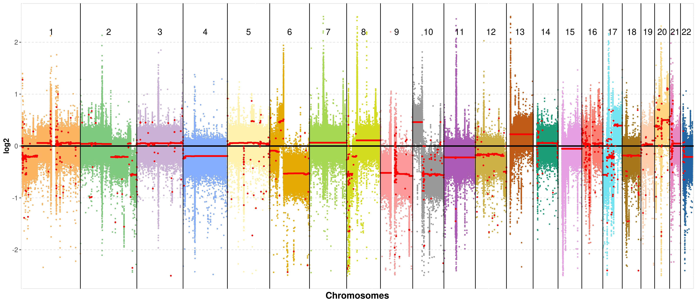

# CNVmap
 CNVmap is tool for visualizing Copy Number Varitions (CNVs) at genome, chromsome and gene levels. The inputs of this tool are .cns and .cnr file formats obtained by the tool CNVkit (https://cnvkit.readthedocs.io/en/stable/).


## Installation

You will need to install it via _GitHub_ using the `devtools` package. To install `devtools`:
```r
install.packages("devtools")
library(devtools)
```

To install CNVmap and its dependencies:
```r
devtools::install_github("BrandoPoggiali/CNVmap")
```

## Update
To update the package, use the following command:
```r
devtools::update("CNVmap")
```

## How to use
Upload .cnr and cns.file in R using the data.table library.

```r
library(data.table)

cnr_data <- fread("path/name.cnr", sep="\t")
cns_data <- fread("path/name.cns", sep="\t")
```

Plot all genome chromosomes

```r
plot_all_chr(cnr_data, cns_data, only_autosomal = TRUE, chr_text_size=5)
```




## Table of contents
* [General info](#general-info)
* [Technologies](#technologies)
* [Setup](#setup)

## General info
This project is simple Lorem ipsum dolor generator.
	
## Technologies
Project is created with:
* Lorem version: 12.3
* Ipsum version: 2.33
* Ament library version: 999
	

## Citation
If you use this tool, please consider citing our publication.

## Contact

Questions, suggestions, and bug reports are welcome and appreciated.
- **Author**: brando Poggiali
- **email**: brando.poggiali@iit.it
- **2° mail**: poggialibrando1995@gmail.com
