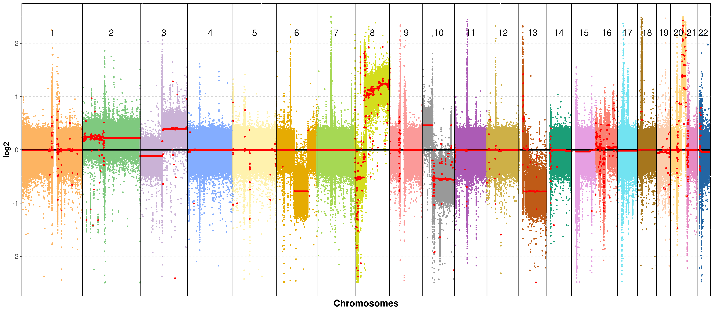
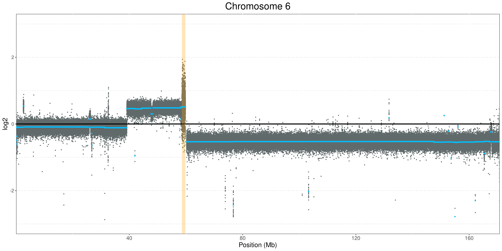

# CNVmap
 CNVmap is tool for visualizing Copy Number Varitions (CNVs) at genome, chromsome and gene levels. The inputs of this tool are .cns and .cnr file formats obtained by the tool CNVkit (https://cnvkit.readthedocs.io/en/stable/).


## Installation

You will need to install it via _GitHub_ using the `devtools` package. To install `devtools`:
```r
install.packages("devtools")
library(devtools)
```

To install CNVmap and its dependencies:
```r
devtools::install_github("BrandoPoggiali/CNVmap")
```

## Update
To update the package, use the following command:
```r
devtools::update("CNVmap")
```

## How to use
Upload .cnr and cns.file in R using the data.table library.

```r
library(data.table)

cnr_data <- fread("path/name.cnr", sep="\t")
cns_data <- fread("path/name.cns", sep="\t")
```
#### All chromosomes
Plot all chromosomes except sex chromosomes. The function is time-intensive. It could take some minutes.

```r
plot_all_chr(cnr_data, cns_data, only_autosomal = TRUE, chr_text_size=5)
```




You can also: plot all chromosomes, remove chromosome text and use a different color for the log2 average value. 
```r
plot_all_chrs(cnr_data, cns_data, chr_text_size = NULL, log2_line_col = "yellow")
```


#### Single chromosomes
It is possible to explore CNVs at chromosomes level.

```r
plot_single_chr(cnr_data, cns_data, chr = "chr6")
```


You can give a list of genes which can be plotted in the graph, if located in that chromosome!

```r
genes_list <- c("BRCA2","FLT1","NOL7", "TP53", "MYC", "NUPL1", "POMP", "HLA-A", "SOX21", "ARG1", "MYO6", "ELOVL5")
plot_single_chr(cnr_data, cns_data, chr = "chr6", genes = genes_list, gene_text_size = 3.3)
```


You easily add a chromosome icon displaying duplicated and deleted regions.

```r
plot_single_chr(cnr_data, cns_data, chr = "chr6", genes = genes_list, gene_text_size = 3.3, chr_picture = TRUE)
```


#### Single gene


## Table of contents
* [General info](#general-info)
* [Technologies](#technologies)
* [Setup](#setup)


## Citation
If you use this tool, please consider citing our publication.

## Contact

Questions, suggestions, and bug reports are welcome and appreciated.
- **Author**: brando Poggiali
- **email**: brando.poggiali@iit.it
- **2° mail**: poggialibrando1995@gmail.com
