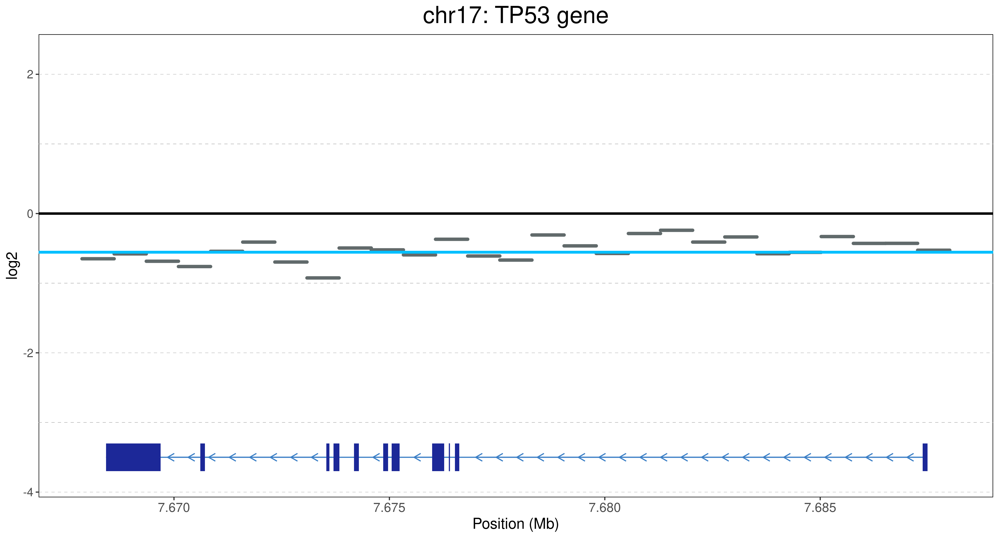

# CNVmap
 CNVmap is a tool for visualizing Copy Number Varitions (CNVs) at genome, chromosome and gene levels. The inputs of this tool are .cns and .cnr file formats obtained by the tool CNVkit (https://cnvkit.readthedocs.io/en/stable/).

&nbsp;

## Installation

You will need to install it via _GitHub_ using the `devtools` package. 
To install `devtools`:

```r
install.packages("devtools")
library(devtools)
```

To install CNVmap and its dependencies:
```r
devtools::install_github("BrandoPoggiali/CNVmap")
```
&nbsp;

## Update
To update the package, use the following command:
```r
devtools::update("CNVmap")
```
&nbsp;

## Usage
Upload .cnr and cns.file in R using the data.table library.

```r
library(data.table)

cnr_data <- fread("path/name.cnr", sep="\t")
cns_data <- fread("path/name.cns", sep="\t")
```
&nbsp;
### All chromosomes plot
Plot all chromosomes except sex chromosomes. The function is time-intensive. It could take some minutes.

```r
plot_all_chr(cnr_data, cns_data, only_autosomal = TRUE, chr_text_size=5)
```


&nbsp;

### Single chromosome plot
It is possible to explore CNVs at chromosomes level.

```r
plot_single_chr(cnr_data, cns_data, chr = "chr6")
```


&nbsp;

You can give a list of genes which can be plotted in the graph, if located in that chromosome!

```r
genes_list <- c("BRCA2","FLT1","NOL7", "TP53", "MYC", "NUPL1", "POMP", "HLA-A", "SOX21", "ARG1", "MYO6", "ELOVL5")
plot_single_chr(cnr_data, cns_data, chr = "chr6", genes = genes_list, gene_text_size = 3.3)
```


&nbsp;

You easily add a chromosome icon displaying duplicated and deleted regions.

```r
plot_single_chr(cnr_data, cns_data, chr = "chr6", genes = genes_list, gene_text_size = 3.3, chr_picture = TRUE)
```


&nbsp;

### Single gene plot
It is possible to explore CNVs at gene level. You have to specify the name of a gene with HGNC ID. 
In this case we look for TP53 gene, the function automatically plot the canonical transcript.

```r
plot_single_gene(cnr_data, cns_data, gene = "TP53")
```


&nbsp;

It is possible to plot a detailed annotation in the plot. In this case the function plot both all transcripts of the gene and the regulatory elements present in that region. 
The color of the regulatory elements follow the in UCSC browser. (red for promoter, orange for distal enhancer, yellow for proximal enhancer, pink for DNase-H3K4me3, and blue for CTCF-only) 

```r
plot_single_gene(cnr_data, cns_data, gene = "TP53", all.transcripts = TRUE, regulatory.elements = TRUE)
```


&nbsp;

## Citation
If you use this tool, please consider citing our publication.

&nbsp;

## Contact

Questions, suggestions, and bug reports are welcome and appreciated.
- **Author**: brando Poggiali
- **email**: brando.poggiali@iit.it
- **2° mail**: poggialibrando1995@gmail.com
